# Demo Front - Football Predictions App

Web application for predicting football match results with scoring system and player rankings.

## Features

- **Dashboard** - User activity summary, prediction statistics, mini ranking, upcoming/recent matches, ranking history chart, nested donut chart
- **Games** - All matches list with prediction management (create, edit, delete), country flags, scores and points
- **Ranking** - Full player ranking with position changes and total points
- **Match Results** - Detailed match view with all user predictions comparison
- **Comments** - View and add comments

## Tech Stack

- **React** 19.2.4 + **Vite** 8.0.1
- **React Router DOM** 7.13.2
- **Bootstrap** 5.3.8 + **React Bootstrap** 2.10.10
- **Chart.js** 4.5.1 + **react-chartjs-2** 5.3.1
- **Axios** 1.14.0
- **FontAwesome** 7.2.0 + **Flag Icons** 7.5.0

## API Endpoints

Backend API: `http://localhost:8080/api`

### User
- `GET /api/user/me` - Current user data
- `GET /api/user` - All users
- `GET /api/user/{id}` - User details

### Games
- `GET /api/games` - All matches
- `GET /api/games/upcoming` - Upcoming matches
- `GET /api/games/finished` - Finished matches
- `GET /api/games/{id}` - Match details

### Predictions
- `GET /api/predictions/my` - My predictions
- `GET /api/predictions/{id}` - Prediction details
- `POST /api/predictions` - Create prediction
- `PUT /api/predictions/{id}` - Update prediction
- `DELETE /api/predictions/{id}` - Delete prediction

### Ranking
- `GET /api/ranking` - Ranking history

### Comments
- `GET /api/comments` - All comments
- `POST /api/comments` - Create comment

### Results
- `GET /api/results/my-prediction-result` - My prediction results
- `GET /api/results/allusers-prediction-result/{gameId}` - All users results for match

### Auth
- `GET /api/auth/check` - Check session
- `POST /api/auth/login` - Login
- `POST /api/auth/logout` - Logout

## Routes

| Path | Component | Description |
|------|-----------|-------------|
| `/` | Redirect | Redirects to `/dashboard` |
| `/dashboard` | Dashboard | Main page with summary |
| `/games` | Games | All matches list |
| `/ranking` | Ranking | Player rankings |
| `/comments` | Comments | Comments section |
| `/results/:gameId` | GameResults | Match results view |
| `/predictions/new/:gameId` | PredictionForm | New prediction form |
| `/predictions/edit/:predictionId` | PredictionForm | Edit prediction form |

## Getting Started

### Prerequisites
- Node.js 18+
- Backend API running on `http://localhost:8080`

### Installation

```bash
npm install
```

### Development

```bash
npm run dev
```

App runs at `http://localhost:5173`

### Build

```bash
npm run build
npm preview
```

## Scoring System

- **3 points** - Exact score match
- **1 point** - Correct result (win/draw/loss) but wrong score
- **0 points** - Wrong prediction

## Configuration

Edit backend URL in `src/services/api.js`:

```javascript
const API_BASE_URL = 'http://localhost:8080/api';
```
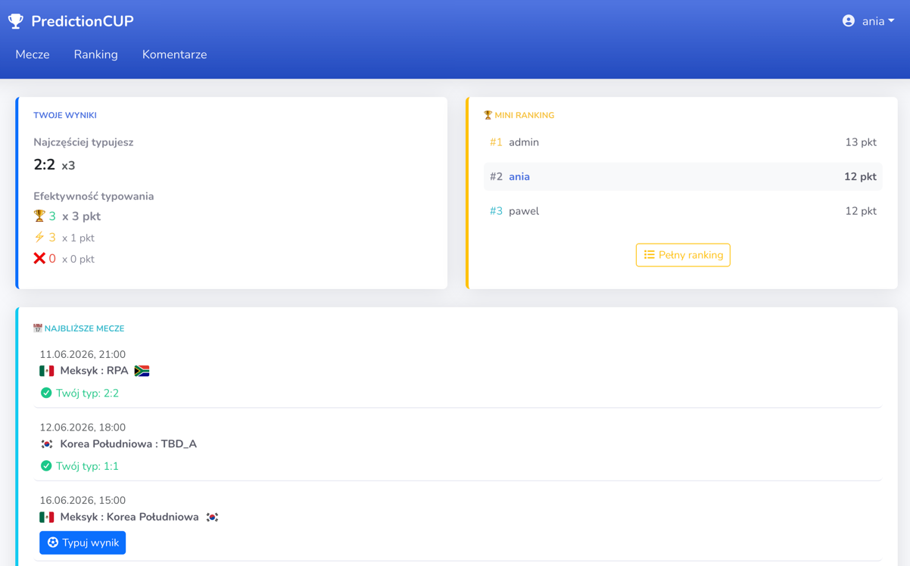

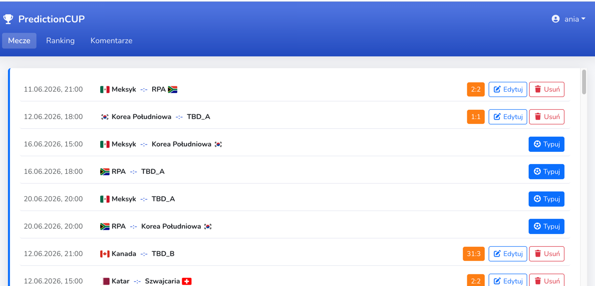

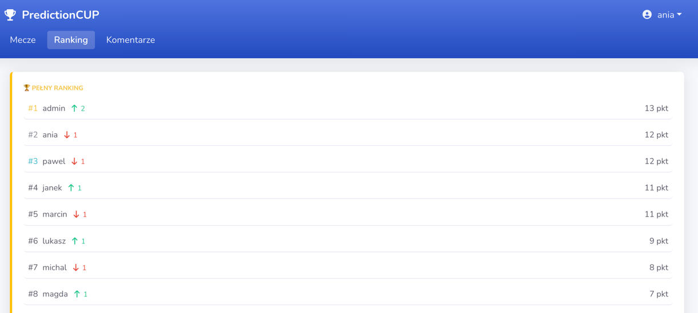

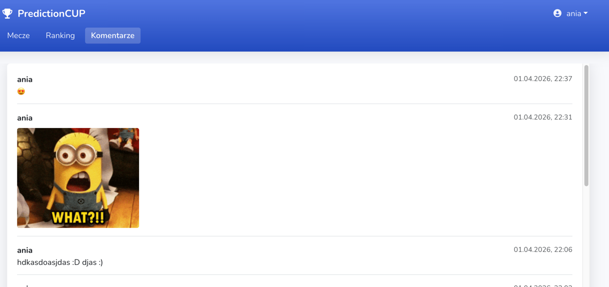


PHONE VIEW 

Dashbord

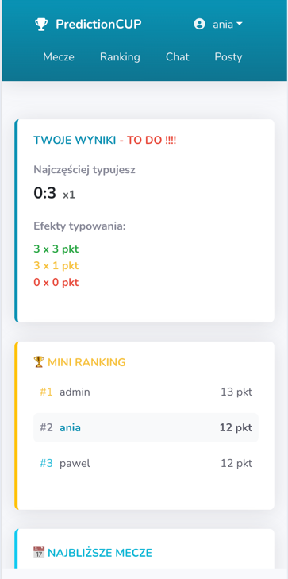

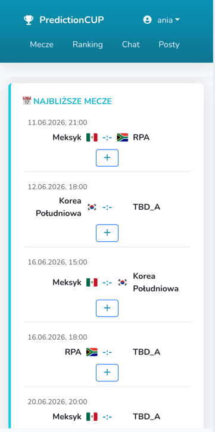
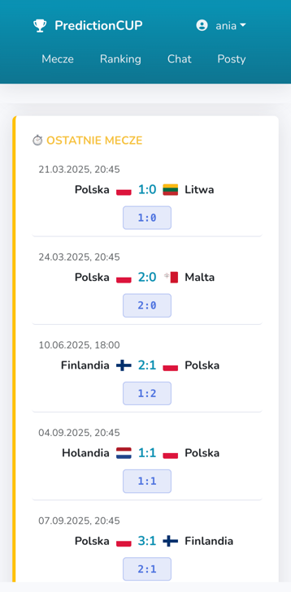
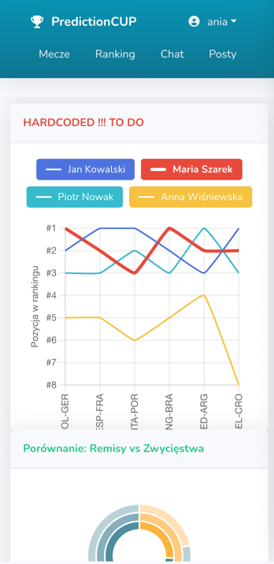

MECZE 
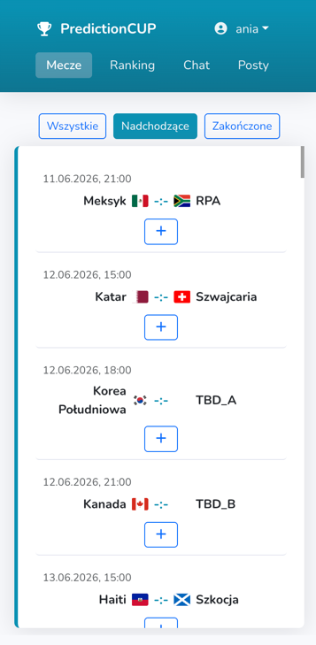
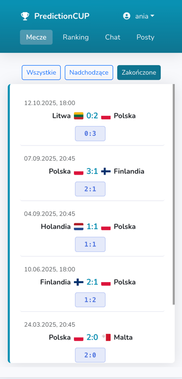

PODGLAD MECZU ZAKONCZONEGO
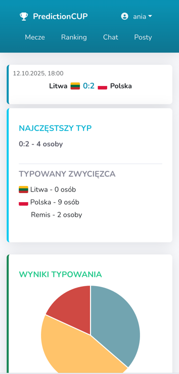
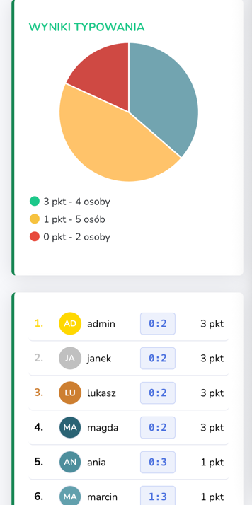

RANKING
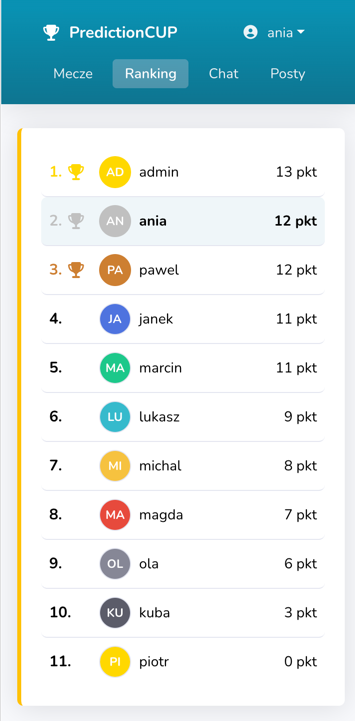

ZALOGOWANY VS WYBRANY USER
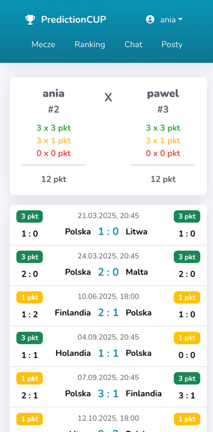

CHAT
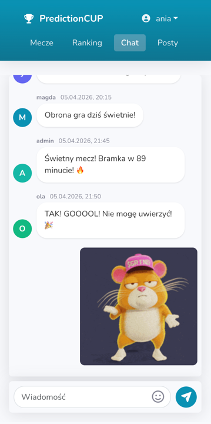

POSTY
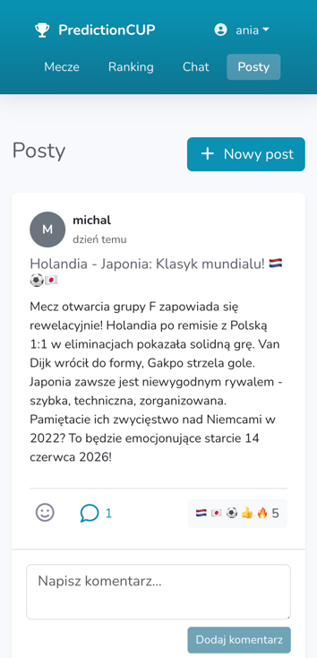

